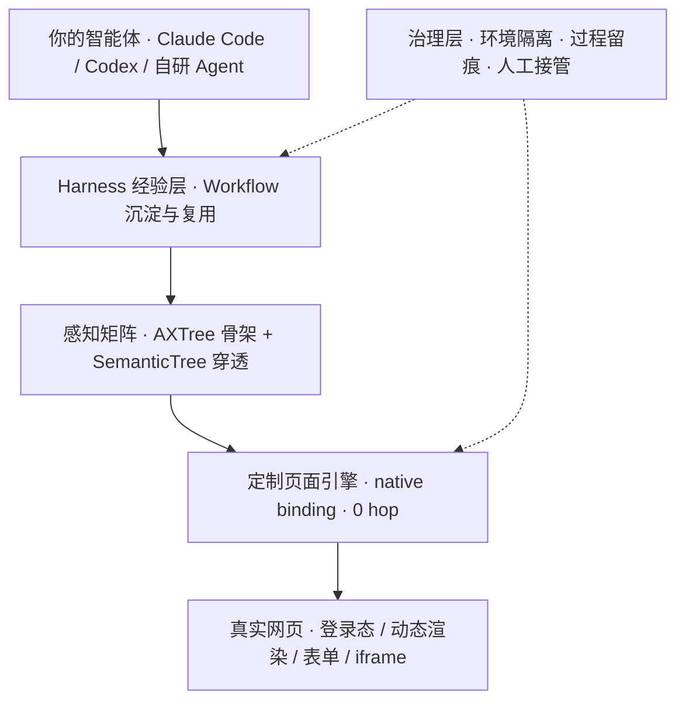
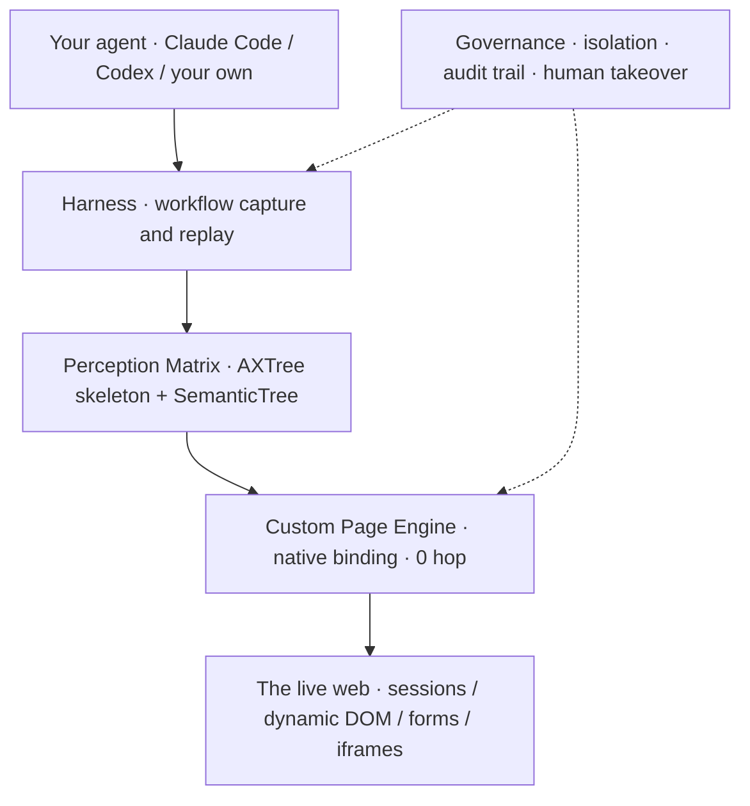

<div align="center">
<a id="chinese"></a>

# Aitheris

### 协助智能体完成繁杂的网页工作

[](https://webcross.ai/zh)
[](https://webcross.ai/zh/download)
[](https://webcross.ai/zh)

**简体中文** · [English](#english)

</div>

---

## 我们在做什么

Aitheris 正在构建 **[WebCross](https://webcross.ai/zh) —— 面向网页自动化的端侧智能体浏览器**。

网页是智能体最难啃的工作场景。今天绝大多数方案的做法，是在原版 Chrome 之上再包一层 JavaScript 适配层，通过 CDP / RPC 远程操控浏览器。这条路径有三个绕不开的问题：

- **慢** —— 每一步操作都要经历序列化、IPC 往返与协议转换，复杂多步链路被中间环节层层放大；
- **贵** —— 把上万行 DOM 粗暴塞进上下文，同类方案单任务动辄十万级 Token；
- **脆** —— 依赖 CSS 选择器定位元素，网站一改版脚本就失效；Shadow DOM 与跨域 iframe 更是直接的交互死角。

我们没有在通用浏览器上做适配，而是**自研页面引擎**，从渲染管线开始为智能体重新设计浏览器：

```text
传统方案   Agent ──▶ JS 适配层 ──CDP / RPC──▶ Chrome ──▶ 渲染管线      1.0×
                     序列化 · IPC 往返 · 协议转换

WebCross   Agent ─────────── native binding · 0 hop ───────▶ 渲染管线   3.2×
```

在直驱引擎之上，我们补齐了一条业务链路真正跑通所需要的另外三层——**感知**（把页面压缩成模型读得懂的语义骨架）、**经验**（把跑通的路径沉淀为可复用 Workflow）、**治理**（环境隔离、过程留痕与人工接管）：



> **关键过程，自主可控。**

---

## 核心能力

### 01 · 定制页面引擎 —— 原生直驱，毫秒级极速响应

传统方案依赖外挂脚本或中转协议控制浏览器，面临显著的延迟与卡顿。WebCross 把自动化能力直接内嵌于定制页面引擎底层，重构执行通道，让智能体的复杂多步操作像真人交互一样即时生效。

- 指令直通渲染管线，无需外部脚本注入
- 剔除协议转换与 RPC 往返，零中间内耗（`native binding · 0 hop`）
- 复杂链路即发即应，同一任务端到端 **提速 3 倍以上**

### 02 · 感知矩阵 —— 极简上下文，零盲区

告别把万行 DOM 粗暴塞进上下文的传统做法。WebCross 采用「全局精简骨架 + 按需深度感知」双层矩阵，在大幅削减上下文负担的同时，兼顾复杂业务场景下的精准交互。

- **AXTree 极简交互骨架**：过滤样式、脚本与无序容器，原生提取操作靶点与 ID —— `12,480 → 1,820 tokens`，**Token 消耗骤降 85%**
- **SemanticTree 深度穿透帧图**：在骨架之上补齐控件的层级、分组与交互关系。相比只做 AXTree 过滤的方案，模型拿到的上下文更短，对页面结构的判断反而更准
- **按需深潜**：Shadow DOM、多层嵌套与跨域 iframe 均可穿透读取，消除交互死角

### 03 · 自主可控 —— 关键过程，清晰可控

从账号凭证、Cookie 会话到执行记录，通过环境隔离、过程留痕与人工接管，让你清晰了解并管理每一个关键任务。

- 账号凭证与 Cookie 会话按任务实例隔离管理
- 执行记录支持留存、审计与回溯
- 关键节点支持人工确认与断点接管

### 04 · 专属 Harness —— 沉淀经验，越用越快

告别每次从零探索的重复损耗。智能体在复杂交互中探索出的成功路径，会被沉淀为高确定性的专属经验与工作流；经验越积越厚，再次执行直达关键节点。

- 交互探索过程自动沉淀为专属经验资产
- 复用经验直达关键路径，跳过试错探索 —— `12.5k → 2.5k tokens`，**再省约 80% Token**
- 沉淀资产可保存、可组合、可跨任务复用

### 05 · 环境矩阵 —— 多账号并行的安全底座

企业级自动化需要严密的环境隔离。WebCross 为每个任务实例构筑专属运行环境，设备特征、网络通道与会话存储全方位物理隔离。

- 实例环境特征独立配置，多任务互不串扰
- 会话状态与本地存储物理隔离，彻底解耦
- 指纹与出口 IP 随时切换，环境模板一键绑定，矩阵秒级就绪
- 例：`12 个实例 · 12 套指纹 · 12 条出口 IP · 互不串号`

### 06 · 人机共管 —— 自动化不等于完全脱管

智能体高效处理繁杂的常规链路，遇到高危支付、权限核验或关键决策时，由人工确认把关，状态原位保活。

- 敏感节点（验证码 / 2FA / 支付确认）自动唤起人工接管卡片，权责清晰
- 任务上下文原位保活，**唤起耗时 < 40 ms**，核验完成后从断点无缝恢复
- 无需重启任务，其他并发实例全程不中断；协同记录清晰留痕

---

## 两种接入方式

**A. 在 WebCross Harness 中直接使用**

用自然语言在控制台下达任务：

> 巡检 Amazon 上的 30 个热门移动电源，整理 url、title、price、rating 和 30 条低评分评论。

智能体会自行打开页面、搜索、点击、采集、整理并导出到本地。跑通后把已验证的执行流程沉淀为 Workflow，下次直接复用。

**B. 在你已有的智能体中使用（Claude Code · Codex 等）**

WebCross Skill 可在应用启动时或「设置」中安装到本地。安装完成后，支持 Skills 的智能体会自动识别并直接调用 WebCross —— **无需手动复制粘贴 Skill 文件，也无需 SDK 集成**。

---

## 典型场景

| | 场景 | 说明 |
|:---:|:---|:---|
| 🛒 | **电商价格与库存巡检** | 每天自动巡检上千个商品链接，价格波动与断货第一时间掌握 |
| 📦 | **商品批量上架与维护** | 批量填表、上图、改属性、调价，上百个 SKU 跑通一次即可规模化复用 |
| 📰 | **跨平台内容采集与互动** | 跨平台采集内容与互动数据，持续沉淀为结构化素材 |
| 🧾 | **批量表单填报与后台录入** | 把没有 API 的老旧系统与 SaaS 后台的重复操作交给智能体 |
| 🏬 | **多店铺 / 多账号并行运营** | 独立指纹与出口 IP，多店铺电商、多账号社交安心并行 |
| 📊 | **竞品与舆情定期监测** | 定时抓取、比对、落表，异常自动上报 |
| 🔁 | **重复流程的 Workflow 化** | 把验证过的执行路径沉淀为资产，让团队复用同一条确定性链路 |
| 🤝 | **给已有智能体加一双「手」** | 通过 Skill 让 Claude Code / Codex 直接获得真实网页的操作能力 |

> 🧭 **以上只是开始——更多场景，等待你亲手挖掘。**
> 只要是「人能在浏览器里点出来」的事，就值得试着交给 WebCross。欢迎把你的玩法告诉我们。

---

<details>
<summary><b>常见问题</b>（点击展开）</summary>

<br>

**与 Playwright、Puppeteer 这类自动化工具有什么不同？**

Playwright 和 Puppeteer 是嵌入代码的浏览器自动化库，依赖 CSS 选择器驱动页面：网站一调整 DOM，脚本就可能失效，而且每一步都需要人工编写。WebCross 采用定制页面引擎直驱——指令直通渲染管线，剔除外挂 JS 适配与 RPC 往返；通过 AXTree + SemanticTree 语义化理解页面，而不是依赖易失效的选择器；用自然语言下达任务即可执行，**无需编写脚本**。

**WebCross 是如何节省 Token 的？**

三层能力叠加：① **AXTree 语义压缩**，把整页压缩成精简语义骨架，剔除样式、脚本与嵌套容器等冗余，上下文体积平均降低 85%；② **SemanticTree 结构补齐**，上下文更短的同时对页面结构的判断更精确，深层嵌套与隔离组件也可直接读取；③ **Workflow 复用**，执行过的任务沉淀为高确定性工作流，下次跳过页面探索直达关键路径，再省 80% 以上。

**多个账号同时运营，会被平台风控关联吗？**

WebCross 为每个账号提供独立的指纹与网络环境：浏览器指纹可独立配置；每个账号拥有独立出口 IP，IP 池随时切换；会话彼此隔离，多账号同时运行不会串号；指纹模板支持复制与批量应用，方便管理多个店铺或社交账号。

**遇到验证码、2FA 或支付确认怎么办？**

WebCross 会自动唤起人工接管卡片：任务在断点处原位暂停，你完成核验后智能体立刻从断点恢复后台执行，整条链路无需重启，其他并发实例全程不受影响，接管过程可留痕。

</details>

---

## 开始使用

| 平台 | 系统要求 |
|:---|:---|
| macOS | 13.0 及以上（Apple Silicon / Intel） |
| Windows | Windows 11 64 位 |

1. 前往 **[下载页面](https://webcross.ai/zh/download)** 选择对应版本
2. 安装后按系统提示开启辅助功能与自动化控制权限
3. 打开 WebCross，在控制面板输入第一条自然语言任务

> 🎉 **公测阶段全功能免费。**

---

## 本组织的仓库

| 仓库 | 用途 |
|:---|:---|
| [`webcross-releases`](https://github.com/Aitheris/webcross-releases) | WebCross 客户端发布包与更新日志，问题反馈请提交 Issue |
| [`.github`](https://github.com/Aitheris/.github) | 组织主页与公共社区文件 |

---

## 关于我们

**Aitheris** 

我们致力于探索人机协同新范式，打造安全、可靠、人人可用的下一代端侧智能基础设施。

> 我们深信，人工智能的真正价值不在于制造无休止的文字对话，而在于深入真实的数字世界，替人类解决繁复、机械的琐碎劳作。通过高可用自研页面引擎与持续完善的运行治理机制，我们致力于让用户对关键任务保持自主可控，将双手与宝贵时间归还给每一位热爱生活与创造的人。

---

## 联系我们

- 🌐 官网：[webcross.ai](https://webcross.ai/zh)（English / 简体中文 / 日本語 / 한국어）
- 📮 商务与技术支持：[service@webcross.ai](mailto:service@webcross.ai)
- 🐛 产品建议与问题反馈：欢迎在 [`webcross-releases`](https://github.com/Aitheris/webcross-releases/issues) 提 Issue

<br>
<br>

<div align="center">
<a id="english"></a>

# Aitheris

### Helping agents finish the tedious web work

[](https://webcross.ai/en)
[](https://webcross.ai/en/download)
[](https://webcross.ai/en)

[简体中文](#chinese) · **English**

</div>

---

## What we're building

Aitheris builds **[WebCross](https://webcross.ai/en) — an on-device autonomous web agent browser**.

The web is the hardest surface for an agent to work on. Almost every solution today wraps stock Chrome in a JavaScript adapter layer and drives it remotely over CDP / RPC. That path carries three problems you cannot engineer around:

- **Slow** — every step pays for serialization, IPC round trips and protocol translation, and a long multi-step chain amplifies that cost at each hop;
- **Expensive** — dumping tens of thousands of DOM lines into context pushes comparable tools past 100k tokens for a single task;
- **Brittle** — CSS selectors break the moment a site ships a redesign, and Shadow DOM or cross-origin iframes are outright blind spots.

Instead of adapting a general-purpose browser, we built **our own page engine** and redesigned the browser around the agent, starting at the render pipeline:

```text
Conventional   Agent ──▶ JS adapter ──CDP / RPC──▶ Chrome ──▶ render pipeline   1.0×
                          serialization · IPC round trips

WebCross       Agent ──────── native binding · 0 hop ──────▶ render pipeline    3.2×
```

On top of that direct-drive engine we built the three other layers a real business task actually needs — **perception** (compress the page into a semantic skeleton a model can read), **experience** (distill a proven path into a reusable workflow), and **governance** (environment isolation, audit trails, human takeover):



> **Critical tasks, under your control.**

---

## Core capabilities

### 01 · Custom Page Engine — native direct-drive, millisecond response

Conventional tooling drives a browser through injected scripts or a relay protocol, and pays for it in latency and stutter. WebCross embeds automation into the page engine itself and rebuilds the execution channel, so a long multi-step operation lands as instantly as a human interaction.

- Commands reach the render pipeline directly, with no external script injection
- No protocol translation, no RPC round trips, zero intermediate overhead (`native binding · 0 hop`)
- Complex chains respond on dispatch — **3×+ faster** end to end on the same task

### 02 · Perception Matrix — minimal context, no blind spots

No more shoving ten thousand lines of DOM into the context window. WebCross runs a two-layer matrix — a global compact skeleton plus deep sensing on demand — cutting context cost while keeping interaction precise on complex pages.

- **AXTree interaction skeleton** — strips styles, scripts and structural containers, extracting actionable targets and IDs natively: `12,480 → 1,820 tokens`, roughly **85% fewer tokens**
- **SemanticTree frame graph** — restores hierarchy, grouping and relationships between controls. Against tools that only filter an AXTree, the model gets *less* context and reads the page *more* accurately
- **On-demand deep dives** — Shadow DOM, deeply nested trees and cross-origin iframes are all readable, so there are no dead ends

### 03 · Control & Governance — critical steps stay legible

From credentials and cookie sessions to run logs, isolation, audit trails and human takeover keep every critical task something you can see and manage.

- Credentials and cookie sessions isolated per task instance
- Run records retained for audit and replay
- Human confirmation and breakpoint takeover at critical steps

### 04 · Dedicated Harness — distilled experience, faster every run

No more re-exploring from scratch on every run. Paths the agent discovers through complex interaction are distilled into high-certainty workflows; the more it runs, the more directly it reaches the steps that matter.

- Exploration is captured automatically as a reusable experience asset
- Replay skips trial and error and goes straight to the critical path: `12.5k → 2.5k tokens`, about **80% fewer tokens**
- Assets can be saved, composed and reused across tasks

### 05 · Environment Matrix — a safe base for parallel accounts

Enterprise automation needs real isolation. WebCross gives every task instance its own runtime — device characteristics, network path and session storage physically separated.

- Independently configured profiles keep concurrent tasks from cross-talking
- Session state and local storage are physically isolated
- Fingerprints and exit IPs switch on demand; templates bind in one click and a matrix is ready in seconds
- For example: `12 instances · 12 fingerprints · 12 exit IPs · zero cross-talk`

### 06 · Human-AI Co-Governance — autonomy is not abandonment

The agent handles the tedious routine chain; when it reaches a risky payment, a permission check or a real decision, a human signs off while the task holds its place.

- Sensitive steps (captcha / 2FA / payment confirmation) raise a takeover card automatically
- Task context is kept alive in place — the card appears in **under 40 ms** — and execution resumes from the exact breakpoint
- No restart, no interruption to other concurrent instances, and the handoff is logged

---

## Two ways to use it

**A. Directly in the WebCross Harness**

Describe the task in plain language on the console:

> Patrol the 30 top-selling power banks on Amazon and collect url, title, price, rating and 30 low-star reviews.

The agent opens the pages, searches, clicks, collects, organizes and exports locally on its own. Once a run is proven, distill it into a workflow and replay it next time.

**B. From the agent you already use (Claude Code, Codex, …)**

The WebCross Skill installs locally at app launch or from Settings. After that, any Skills-capable agent discovers and calls WebCross directly — **no copying skill files by hand, no SDK integration**.

---

## Use cases

| | Scenario | What it looks like |
|:---:|:---|:---|
| 🛒 | **Price & stock patrol** | Sweep thousands of listings daily; catch every price move and stockout as it happens |
| 📦 | **Bulk listing & upkeep** | Fill forms, upload images, edit attributes and reprice — prove it once, then scale to hundreds of SKUs |
| 📰 | **Cross-platform content & engagement** | Collect posts and engagement data across platforms into structured datasets |
| 🧾 | **Bulk form filling & back-office entry** | Hand legacy systems and API-less SaaS admin panels to the agent |
| 🏬 | **Multi-store / multi-account operations** | Independent fingerprints and exit IPs let stores and social accounts run in parallel safely |
| 📊 | **Competitive & sentiment monitoring** | Scheduled collection, comparison and reporting, with alerts on anomalies |
| 🔁 | **Turning repeat work into workflows** | Capture a proven path as an asset so the whole team replays the same deterministic chain |
| 🤝 | **Giving your agent hands** | A Skill install is all it takes for Claude Code or Codex to act on the real web |

> 🧭 **This is only the beginning — the best use cases are the ones you'll find yourself.**
> If a person can click through it in a browser, it's worth handing to WebCross. Tell us what you build.

---

<details>
<summary><b>FAQ</b> (click to expand)</summary>

<br>

**How is this different from Playwright or Puppeteer?**

Playwright and Puppeteer are code-embedded automation libraries driven by CSS selectors: scripts break whenever a site changes its DOM, and every step has to be written by hand. WebCross drives the page from a custom engine — commands reach the render pipeline directly, without a JS adapter or RPC round trips; pages are understood semantically through AXTree + SemanticTree instead of fragile selectors; and tasks are issued in natural language, so **no scripting is required**.

**How does WebCross save tokens?**

Three layers compound: ① **AXTree compression** reduces the page to a compact semantic skeleton, dropping styles, scripts and container nesting for roughly 85% less context; ② **SemanticTree completion** yields shorter context *and* a more accurate read of page structure, including deeply nested and isolated components; ③ **workflow replay** turns a completed run into a deterministic asset, skipping exploration entirely on the next run for another 80%+.

**Will running several accounts get them linked by platform risk controls?**

Every account gets its own fingerprint and network environment: browser fingerprints are configured independently, each account has its own exit IP with a switchable pool, sessions are isolated so concurrent accounts never cross-talk, and fingerprint templates can be cloned and applied in bulk across stores or social accounts.

**What happens at a captcha, 2FA or payment confirmation?**

WebCross raises a takeover card automatically. The task pauses in place at the breakpoint; once you verify, the agent resumes background execution from that exact point. The chain never restarts, other concurrent instances are unaffected, and the handoff is recorded.

</details>

---

## Getting started

| Platform | Requirement |
|:---|:---|
| macOS | 13.0 or later (Apple Silicon / Intel) |
| Windows | Windows 11, 64-bit |

1. Pick your build on the **[download page](https://webcross.ai/en/download)**
2. Install, then grant the accessibility and automation permissions your OS prompts for
3. Open WebCross and type your first natural-language task into the console

> 🎉 **Every feature is free during the public beta.**

---

## Repositories

| Repository | Purpose |
|:---|:---|
| [`webcross-releases`](https://github.com/Aitheris/webcross-releases) | WebCross client releases and changelogs — open an issue for bug reports |
| [`.github`](https://github.com/Aitheris/.github) | Organization profile and shared community files |

---

## About us

**Aitheris**

We explore new models of human-AI collaboration and build the next generation of safe, reliable, genuinely usable on-device intelligence infrastructure.

> We believe the real value of AI is not in generating endless conversation, but in stepping into the actual digital world to take the repetitive, mechanical drudgery off people's hands. Through a high-availability in-house page engine and a governance layer we keep sharpening, we work to keep critical tasks under your control — and give hands and hours back to everyone who would rather be living and creating.

---

## Contact

- 🌐 Website: [webcross.ai](https://webcross.ai/en) (English / 简体中文 / 日本語 / 한국어)
- 📮 Business & technical support: [service@webcross.ai](mailto:service@webcross.ai)
- 🐛 Feedback & bug reports: open an issue on [`webcross-releases`](https://github.com/Aitheris/webcross-releases/issues)

<div align="center">
<br>

**Aitheris** · Make the web actually navigable for agents  ·

</div>
